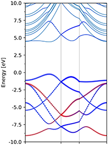
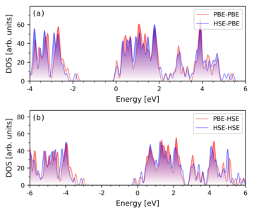

# Introduction

`pyband` and `pydos` are two python scripts that analyse the VASP calculation
results (e.g. OUTCAR and PROCAR) and  convert the results to images. It offers a
fast and effective way to preview the calcuated results. The image plotting
utilizes `matplotlib` package.

# Examples
## pyband

When no argument is given, `pyband` reads in `OUTCAR` (optionally `KPOINTS`)
and find the band information within. It then plots the resulting band structure
and save it as `band.png`.

```$ pyband```


The default output image name  can be changed by adding `-o
YourImageName.suffix` to the above command line.  Note that the image format is
automatically recognized by the script, which can be any format that is
supported by `matplotlib`. The size of the image can also be speified by `-s
width height` command line arguments.

The labels of the high-symmetry K-points, which are not shown in the figure, can
be designate by `-k` flag.

```$ pyband -k mgkm```


In some cases, if you are interested in finding out the characters of each KS
states, e.g. the contribution of some atom to each KS state, the flag `--occ
atoms` comes to help.

```$ pyband --occ '1 3 4'```

or

```$ pyband --occ '1-4'```

or combination

```$ pyband --occ '1-4 5-6 7'```

Note the the index `0` is a special one, it is used select all the atoms

```$ pyband --occ 0```


where `1 3 4` are the atom index starting from 1 to #atoms  in the above image.
The size of red dots in the figure indicates the weight of the specified atoms
to the KS states.  This can also be represented using a colormap:

```$ pyband --occ '1 3 4' --occL```


The spd-projected weight can also be specefied:

```$ pyband --occ '1 3 4' --spd '4 5 6 7 8' ```

or

```$ pyband --occ '1 3 4' --spd 'd' ```

or in combination

```$ pyband --occ '1 3 4' --spd 's p d 9-12' ```


where in the arguments of `--spd`:


> s orbital: 0

> py, pz, px orbital: 1 2 3

> dxy, dyz, dz2, dxz, dx2 orbital: 4 5 6 7 8

More command line arguments can be found by `pyband -h`.

For Mac users, [iterm2](https://iterm2.com/) combined with [imgcat](https://iterm2.com/documentation-shell-integration.html) can be used to show inline images. Just modify the last line from:
```
        call(['feh', '-xdF', opts.bandimage])
```
to
```
        call(['~/.iterm2/imgcat',  opts.bandimage])
```

more example:

`pyband --occ '3 4' --spd '1' --occMc 'red' --occ '3-4' --spd '2-3' --occMc 'blue'`



### Plotable data
`pyband` command produces plotable data with a `GNUPLOT` compatiable format. Files are named "pyband.dat" for spinless or SOC calculations and "pyband_up(do).dat" for spinfull calculations. Plot the bandsturcture by:

```
$ gnuplot -presist  -e 'plot "pyband.dat" u 1:($2-3.0913) w l'
```

## pydos

This script is used to plot partial density of states (pDOS) from VASP `PROCAR`
files.

`pydos -p '1 3 4' -p '2 7 8' -p '5 6 9' -z 0.65 -x -1 2  -y 0 6`


where `-p` specifies the atom indexes, `-x` and `-y` determines the x and y
limits of the plot, `-z` is followed by the energy reference of the plot.


## npdos

This script can plot PDOS from multiple VASP `PROCARs` in multiple axes, example usages:

```bash

#!/bin/bash

npdos -nr 2 -f 4.8 4.0 \
    -o g1.png \
    -nxminor 4 \
    -i pbe/scf/PROCAR         -a 0 -p 0 -pv n -tlab 'PBE-PBE' -tlw 0.5 -tlc r \
    -i scf-pbe_opt-hse/PROCAR -a 0 -p 0 -pv n -tlab 'HSE-PBE' -tlw 0.5 -tlc b \
    -i scf-hse_opt-pbe/PROCAR -a 1 -p 0 -pv n -tlab 'PBE-HSE' -tlw 0.5 -tlc r \
    -i hse/scf/PROCAR         -a 1 -p 0 -pv n -tlab 'HSE-HSE' -tlw 0.5 -tlc b \
    -x -4 6 -x -6 6 \
    -z 3.3129 -z 3.3726 -z 3.5583 -z 3.6332 \
    -panelloc 0.01 0.95 \
    -q  
```

The resulting figure:



## xcell.py

This script utilize [ASE](https://wiki.fysik.dtu.dk/ase/ase/io/io.html) to make
supercells. The coordinates of the atoms in the resulting supercell is
rearranged in the increasing order in the z-axis. It can also rearrange the
elements in `POSCAR` in the required order. Moreover, vacuum can be added in the
desired direction if specified. Examples usage:

```
xcell.py -i POSCAR -s 2 2 1 -n Ti O C H -vacuum 15  -ivacuum z -o new.vasp
```

In the above example, we are makeing a 2x2x1 supercell based on the cell given
by `POSCAR`. The elements in the supercell are arranged in "Ti O C H" order. In
addition, we add a vacuum of 15 Angstrom in the z-axis. The resulting supercell
is stored in the file `new.vasp`.


## molAdd.py

This script also make use of `ASE` to adsorb molecules onto the slab surface.
Examples usage:

```
molAdd.py -m H2O -i POSCAR -a 36 --height 2.0 -rotx 60 -v 15.0
```

where we add a H2O molecule above the atom with index 36 (which is the 37th
atom) by a height of 2.0 Angstrom. In addition, we rotate the molecule around
x-axis by 60 degrees and add 15.0 Angstrom of vacuum to the slab.  The list of
available molecules is those from `ase.collection.g2` database.
