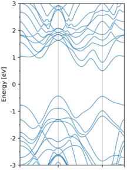
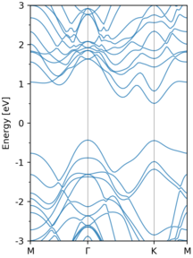
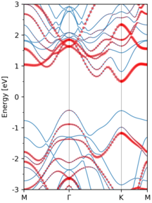
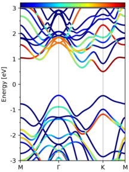
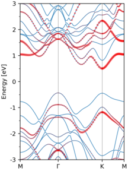
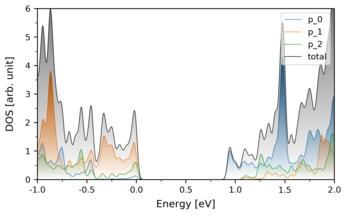

# Introduction

`pyband` and `pydos` are two python scripts that take in the VASP calculation results (e.g. OUTCAR and PROCAR) and  convert the results to images. It offers a fast and effective way to preview the calcuated results. The image plotting utilizes `matplotlib` package.

# Examples
## pyband

When no arguments is given, `pyband` reads in `OUTCAR` (optionally `KPOINTS`) and find the band information within. It then plot the resulting band structure and save it as `band.png`.

```$ pyband```



The default output image name  can be changed by adding `-o YourImageName.suffix` to the above command line.  Note that the image format is automatically recognized by the script, which can be any format that is supported by `matplotlib`. The size of the image can also be speified by `-s width height` command line arguments. 

In the above image, the name of the high-symmetry K-point is not shown, which can be specifiec by `-k` flag.

```$ pyband -k mgkm```



In some cases, if you are interested in finding out the characters of each KS states, e.g. the contribution of some atom to each KS state, the flag `--occ atoms` comes into help.

```$ pyband --occ '1 3 4'```



where `1 3 4` are the atom index starting from 1 to #atoms  in the above image. The size of red dots in the figure indicates the weight of the specified atoms to the KS states.  This can also be represented using a colormap:

```$ pyband --occ '1 3 4' --occL```



The spd-projected weight can also be specefied:

```$ pyband --occ '1 3 4' --spd '4 5 6 7 8' ```



where in the arguments of `--spd`:


> s orbital: 0

> py, pz, px orbital: 1 2 3

> dxy, dyz, dz2, dxz, dx2 orbital: 4 5 6 7 8

More command line arguments can be found by `pyband -h`.

## pydos

This script is used to plot partial density of states (pDOS) from VASP `PROCAR` files. 

`pydos -p '1 3 4' -p '2 7 8' -p '5 6 9' -z 0.65 -x -1 2  -y 0 6`



where `-p` specifies the atom indexes, `-x` and `-y` determines the x and y limits of the plot, `-z` is followed by the energy reference of the plot.